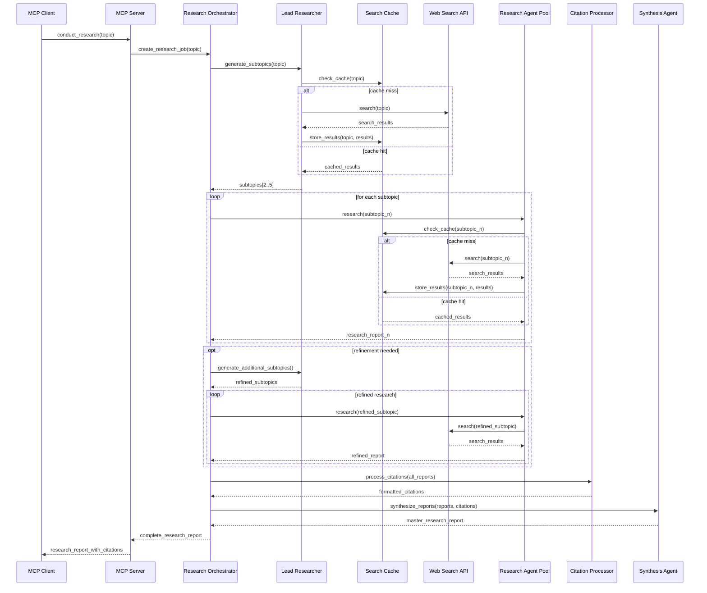

# (WIP) Deep Research MCP Server

A research orchestration MCP server. This system implements a hierarchical research architecture where a lead researcher coordinates multiple specialized research agents to conduct investigations on complex topics, generating detailed reports with proper citations and analysis.

Modeled loosely after Claude's [Research Tool](https://www.anthropic.com/engineering/multi-agent-research-system).

## Quick Start

### Prerequisites

- Python 3.12 or higher
- [uv](https://docs.astral.sh/uv/) package manager
- Brave Search API key
- AWS Bedrock access (recommended) or Ollama setup

### Installation

1. **Clone the repository:**
   ```bash
   git clone <repository-url>
   cd research-mcp
   ```

2. **Install dependencies:**
   ```bash
   uv sync
   ```

3. **Configure environment:**
   ```bash
   cp .env.example .env
   # Edit .env with your API keys and model settings
   ```

### Environment Variables

```bash
# Required: Brave Search API
BRAVE_API_KEY=your_brave_api_key_here

# Model Configuration
MODEL_TYPE=bedrock  # or "ollama"

# For Bedrock (recommended)
BEDROCK_MODEL=anthropic.claude-3-5-sonnet-20241022-v2:0
BEDROCK_REGION=us-east-1

# For Ollama (alternative)
OLLAMA_HOST=http://localhost:11434
OLLAMA_MODEL=your_model_name
```

## Usage

### MCP Server

**Start the MCP server:**
```bash
uv run mcp dev src/mcp_server/server.py
```

**Use via MCP client:**
The server provides a `conduct_research` tool that accepts a topic string and returns a research report.

### Using Docker (with Bedrock backend)

Create a `.env` file with appropriate environment variables, and then
Add the following command to your MCP configuration:

```bash
docker run -i --rm -v /path/to/your.env:/app/.env:ro -v /home/you/.aws:/home/mcp/.aws ghcr.io/karashiiro/research-mcp:main
```

## Advanced Usage

**Clear cache (for fresh web searches):**
```bash
rm -rf cache/
```

**View research progress logs:**
```bash
cat logs/research_results.log
```

## Architecture


